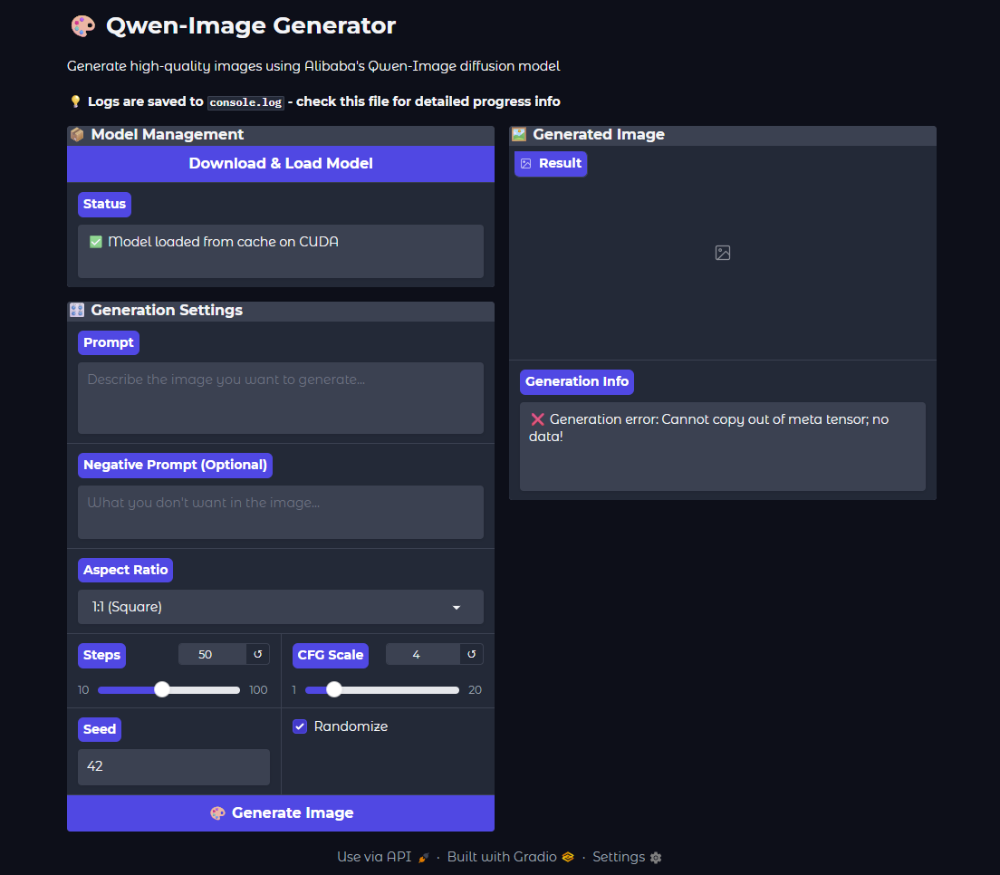

# Qwen-Image Generator

A cross-platform desktop application providing a user-friendly GUI for Alibaba's Qwen-Image diffusion model. Built with Python/Gradio backend and designed for future Tauri desktop distribution.



## 🚀 Features

- **🎨 Easy Image Generation**: Simple web interface for text-to-image generation
- **🧠 Smart Memory Management**: CPU offloading for large models with GPU acceleration
- **⚡ Auto-Configuration**: Automatic GPU/CPU detection and optimization
- **📦 One-Click Setup**: Automatic model download and caching
- **🔧 Advanced Controls**: Multiple aspect ratios, CFG scale, steps, and seed controls
- **📊 Real-Time Monitoring**: Comprehensive logging and progress tracking
- **🌐 Cross-Platform**: Works on Windows, macOS, and Linux

## 🖼️ Generated Image Quality

The Qwen-Image model produces high-quality images with:
- **High Resolutions**: Up to 1664x928 (16:9) and 1328x1328 (1:1)
- **Multiple Aspect Ratios**: 1:1, 16:9, 9:16, 4:3, 3:4, 3:2, 2:3
- **Advanced Controls**: CFG scale, negative prompts, custom seeds
- **Professional Quality**: 4K, ultra HD, cinematic composition enhancement

## 🛠️ Quick Start

### Prerequisites
- **Python 3.10+** with pip
- **PowerShell** (Windows) for best compatibility
- **16GB+ RAM** recommended
- **NVIDIA GPU with 8GB+ VRAM** (optional, but recommended)

### Installation

1. **Clone the repository**:
```powershell
git clone https://github.com/DexterLagan/qwen-image-generator.git
cd qwen-image-generator
```

2. **Install dependencies**:
```powershell
pip install -r requirements.txt
```

3. **Launch the application**:
```powershell
python qwen_gui.py
```

4. **Open your browser** to `http://localhost:7860`

5. **First run**: Click "Download & Load Model" (one-time ~4GB download)

## 📦 Model Variants

Two versions of the Qwen-Image model are available:

- **FP8 (~20GB)** – https://huggingface.co/Qwen/Qwen-Image
- **FP16 (~40GB)** – https://huggingface.co/Qwen/Qwen-Image-FP16

Select the desired variant in the application before downloading.

## 🧠 Advanced Memory Management

### Automatic Optimization
The application automatically detects your hardware and optimizes accordingly:

- **GPU Available (16GB+ VRAM)**: Full GPU acceleration
- **GPU Available (<16GB VRAM)**: CPU offloading with GPU compute
- **CPU Only**: Sequential CPU offloading with memory optimization

### Features
- **CPU Offloading**: Stores large models in RAM, uses GPU for computation
- **Attention Slicing**: Reduces memory usage during generation  
- **Smart Caching**: Reuses downloaded model files
- **Memory Monitoring**: Real-time RAM/VRAM usage reporting

## 📁 Project Structure

```
qwen-image-generator/
├── qwen_gui.py                           # 🚀 Main Gradio application
├── qwen_sample_hf.py                     # 📖 Official HuggingFace reference
├── qwen_gradio_proto_chatgpt_wrong.py    # 📁 Legacy prototype (archived)
├── test_launch.py                        # 🧪 Basic functionality test
├── requirements.txt                      # 📦 Python dependencies
├── console.log                           # 📋 Application logs
├── model/cache/                          # 🤖 Downloaded model files
├── output/                               # 🖼️ Generated images
└── screenshots/                          # 📸 Documentation images
```

## ⚙️ Technical Details

### Model Integration
- **API**: Uses `diffusers.DiffusionPipeline` (not transformers)
- **Model**: Qwen/Qwen-Image from Hugging Face
- **Parameters**: Official `true_cfg_scale`, aspect ratios, and resolutions
- **Caching**: Intelligent model file verification and reuse

### Compatibility
- **PyTorch**: CUDA-enabled version for GPU acceleration
- **Gradio**: Latest version with compatibility fixes
- **Cross-Platform**: Windows tested, Linux/macOS compatible

### Performance Optimizations
- **Environment Variables**: CUDA memory optimization settings
- **Progressive Loading**: Components loaded sequentially
- **Error Recovery**: Multiple fallback strategies for reliability

## 🔧 Configuration

### Environment Variables
The application sets optimal CUDA configurations automatically:
```python
os.environ['PYTORCH_CUDA_ALLOC_CONF'] = 'expandable_segments:True'
```

### Model Storage
- **Windows**: `model/cache/models--Qwen--Qwen-Image/`
- **Output**: `output/qwen_image_YYYYMMDD_HHMMSS_seedXXXXXX.png`

## 🚀 Future Development

### Planned Tauri Integration
- **Native Desktop App**: Rust-based wrapper for system integration
- **Embedded Runtime**: Self-contained Python environment
- **Cross-Platform Distribution**: .exe, .app, and .deb packages
- **Enhanced UX**: Native file dialogs, system tray, auto-updater

### Roadmap
- [ ] Tauri desktop wrapper implementation
- [ ] Batch image generation
- [ ] Image gallery and history
- [ ] Advanced prompt templates
- [ ] Model fine-tuning support

## 📦 Package Versions

### Exact Tested Versions
The following versions have been tested and work together:

```
torch==2.7.1
torchvision==0.22.1
transformers==4.55.0
accelerate==1.10.0
safetensors==0.5.3
gradio==5.41.1
psutil==7.0.0
```

### CUDA Installation (Windows/Linux)
For GPU support (though CPU-only mode is recommended for this model):
```bash
pip install torch torchvision --index-url https://download.pytorch.org/whl/cu118
```

## 🐛 Troubleshooting

### Critical Issues & Solutions

#### **Model Loading Crashes at "Checkpoint Shards 6/9" (MOST COMMON)**
**Symptoms**: Process exits/crashes during model loading without error message
**Cause**: Insufficient Windows virtual memory for large model loading
**Solution**: 
1. Press `Win + R`, type `sysdm.cpl`, press Enter
2. Advanced tab → Performance Settings → Advanced → Virtual Memory Change
3. Uncheck "Automatically manage", select "Custom size"
4. Set Initial: `50000` MB, Maximum: `50000` MB
5. Click Set → OK → Restart computer
**Impact**: **CRITICAL** - Model will not load without this fix

#### **"CUDA Out of Memory" Errors**
**Symptoms**: CUDA OOM errors despite CPU-only configuration
**Cause**: Qwen-Image model (~20GB) too large for most GPUs
**Solution**: Application automatically uses CPU-only mode
**User Action**: Restart application if error persists

#### **"Cannot copy out of meta tensor" Error**
**Symptoms**: NotImplementedError during image generation
**Cause**: Mixed GPU/CPU operations creating invalid tensor states
**Solution**: Application uses pure CPU-only mode to prevent this
**User Action**: Restart application, ensure CPU-only mode is active

#### **Model File Corruption**
**Symptoms**: Loading fails partway through, safetensors errors
**Cause**: Interrupted downloads, disk issues, or network problems
**Solution**: Click "🗑️ Clear Cache & Re-download" button
**Prevention**: Ensure stable internet connection during initial download

#### **Gradio Server Won't Start**
**Symptoms**: "Unable to configure formatter" errors
**Cause**: Logging conflicts between custom code and Gradio
**Solution**: Fixed in current version with proper logging configuration
**User Action**: Use PowerShell instead of CMD on Windows

### System Requirements

#### **Minimum Requirements**
- **RAM**: 24GB available RAM (32GB total recommended)
- **Storage**: 10GB free space (4GB model + 6GB temporary)
- **CPU**: Multi-core processor (Intel i5/AMD Ryzen 5 or better)
- **OS**: Windows 10/11 (PowerShell required)

#### **Critical Configuration**
- **Virtual Memory**: 50GB Windows page file (ESSENTIAL)
- **Python**: 3.10+ with pip
- **Network**: Stable connection for initial 4GB download

#### **Performance Notes**
- **Generation Time**: 5-15 minutes per image on CPU
- **Loading Time**: 5-10 minutes first run (one-time)
- **GPU Usage**: Not recommended due to 20GB model size

### Debug Information
- **Logs**: Check `console.log` for detailed operation information
- **Status**: UI shows real-time model status and error details
- **Memory**: Application monitors and reports RAM usage
- **Recovery**: Automatic cache clearing on corruption detection

### Platform-Specific Notes

#### **Windows**
- **Use PowerShell** (not CMD) for better Unicode support
- **Page file configuration** is essential for model loading
- **Antivirus**: May quarantine model files, add exclusion for project folder

#### **Linux**
- Install packages may require `sudo` permissions
- Virtual memory configuration varies by distribution
- Monitor `/tmp` space during model loading

### Common Error Messages

| Error | Cause | Solution |
|-------|-------|----------|
| Process killed at shard 6/9 | Insufficient virtual memory | Increase Windows page file to 50GB |
| CUDA out of memory | Model too large for GPU | Application auto-uses CPU mode |
| Safetensors error | Corrupted model files | Use "Clear Cache & Re-download" button |
| Network timeout | Unstable connection | Retry download, check internet |
| Permission denied | Folder access issues | Run as administrator or check permissions |
| Import errors | Missing dependencies | Reinstall with `pip install -r requirements.txt` |

### Performance Optimization
- **Close other applications** to free RAM during loading
- **Use SSD storage** if available for faster model loading
- **Disable antivirus real-time scanning** for project folder temporarily
- **Increase page file on fastest drive** (usually C:) for better performance

## 📄 License

This project is licensed under the GNU General Public License v3.0 - see the [LICENSE](LICENSE) file for details.

### Model License
The Qwen-Image model is licensed under the Qianwen License 1.0:
- ✅ **Free** for personal, research, and evaluation use
- ❌ **Commercial use** requires separate license from Alibaba

## 👏 Credits

- **Model**: Alibaba Qwen Team ([Qwen-Image](https://huggingface.co/Qwen/Qwen-Image))
- **Framework**: Hugging Face ([Diffusers](https://github.com/huggingface/diffusers), [Gradio](https://gradio.app/))
- **Future Desktop**: [Tauri](https://tauri.app/)
- **Author**: Dexter Santucci

## 🤝 Contributing

Contributions are welcome! Please feel free to submit a Pull Request. For major changes, please open an issue first to discuss what you would like to change.

## 📞 Support

If you encounter any issues:
1. Check the `console.log` file for error details
2. Ensure you're using PowerShell on Windows
3. Verify your Python and dependency versions
4. Open an issue on GitHub with your log file